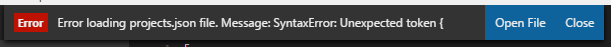

[](https://marketplace.visualstudio.com/items?itemName=alefragnani.project-manager)
[](https://marketplace.visualstudio.com/items?itemName=alefragnani.project-manager)
[](https://marketplace.visualstudio.com/items?itemName=alefragnani.project-manager)

<p align="center">
  <br />
  <a title="Learn more about Project Manager" href="http://github.com/alefragnani/vscode-project-manager"></a>
</p>

# What's new in Project Manager 13.0

* Fully Open Source again
* Adds **Profile** support
* Highlights the current project in the Side Bar
* Published to **Open VSX**
* Adds **Getting Started / Walkthrough**
* Organize your projects with **Tags**
* Adds **Virtual Workspaces** support
* Adds **Workspace Trust** support

# Support

**Project Manager** is an extension created for **Visual Studio Code**. If you find it useful, please consider supporting it.

<table align="center" width="60%" border="0">
  <tr>
    <td>
      <a title="Paypal" href="https://www.paypal.com/cgi-bin/webscr?cmd=_donations&business=EP57F3B6FXKTU&lc=US&item_name=Alessandro%20Fragnani&item_number=vscode%20extensions&currency_code=USD&bn=PP%2dDonationsBF%3abtn_donate_SM%2egif%3aNonHosted"></a>
    </td>
    <td>
      <a title="GitHub Sponsors" href="https://github.com/sponsors/alefragnani"></a>
    </td>
    <td>
      <a title="Patreon" href="https://www.patreon.com/alefragnani"></a>
    </td>
  </tr>
</table>

# Project Manager

It helps you to easily access your **projects**, no matter where they are located. _Don't miss those important projects anymore_. 

You can define your own **Projects** (also called **Favorites**), or choose for auto-detect **Git**, **Mercurial** or **SVN** repositories, **VSCode** folders, or **any** other folder.

Here are some of the features that **Project Manager** provides:

* Save any folder or workspace as a **Project**
* Auto-detect **Git**, **Mercurial** or **SVN** repositories
* Organize your projects using **Tags**
* Open projects in the same or new window
* Identify _deleted/renamed_ projects
* A **Status Bar** which identifies the current project
* A dedicated **Side Bar**

# Features

## Available Commands

* `Project Manager: Save Project` Save the current folder/workspace as a new project
* `Project Manager: Edit Project` Edit your projects manually (`projects.json`)
* `Project Manager: List Projects to Open` List all saved/detected projects and pick one
* `Project Manager: List Projects to Open in New Window` List all saved/detected projects and pick one to be opened in New Window
* `Project Manager: Filter Projects by Tag` Filter the Favorite projects by selected tags

## Manage your projects

### Save Project

You can save the current folder/workspace as a **Project** at any time. You just need to type its name. 


> It suggests a name to you _automatically_ :)
 
### Edit Projects

For easier customization of your project list, you can edit the `projects.json` file, directly inside **Code**. Just execute `Project Manager: Edit Projects` and the `projects.json` file is opened. Simple as this:

```json
[
    {
        "name": "Pascal MI",
        "rootPath": "c:\\PascalProjects\\pascal-menu-insight",
        "tags": [],
        "enabled": true,
        "profile": "Delphi"
    },
    {
        "name": "Bookmarks",
        "rootPath": "$home\\Documents\\GitHub\\vscode-bookmarks",
        "tags": [
            "Personal",
            "VS Code"
        ],
        "enabled": true,
        "profile": "VSCode"
    },
    {
        "name": "Numbered Bookmarks",
        "rootPath": "~\\Documents\\GitHub\\vscode-numbered-bookmarks",
        "tags": [
            "Personal",
            "VS Code"
        ],
        "enabled": false,
        "profile": "VSCode"
    }
]
```

> You can use `~` or `$home` while defining any path. It will be replaced by your HOME folder.

> Be sure that the JSON file is well-formed. Otherwise, **Project Manager** will not be able to open it, and an error message like this should appear. In this case, you should use the `Open File` button to fix it.



## Access 

### List Projects to Open

Shows your projects and select one to open.

### List Projects to Open in New Window

Just like **List Projects** but always opening in **New Window**.

## Keyboard Focused Users

If you are a keyboard focused user and uses _Vim like_ keyboard navigation, you can navigate thru the project list with your own keybindings. 

Just use the `when` clause `"inProjectManagerList"`, like:

```json
    {
        "key": "cmd+j",
        "command": "workbench.action.quickOpenSelectNext",
        "when": "inProjectManagerList && isMac"
    },
    {
        "key": "cmd+shift+j",
        "command": "workbench.action.quickOpenSelectPrevious",
        "when": "inProjectManagerList && isMac"
    },
    {
        "key": "ctrl+j",
        "command": "workbench.action.quickOpenSelectNext",
        "when": "inProjectManagerList && (isWindows || isLinux)"
    },
    {
        "key": "ctrl+shift+j",
        "command": "workbench.action.quickOpenSelectPrevious",
        "when": "inProjectManagerList && (isWindows || isLinux)"
    }
```

## Working with Remotes

The extension support [Remote Development](https://code.visualstudio.com/docs/remote/remote-overview) scenarios, and you may choose how to use it, depending on your needs

### I access Remotes, but most of my work is Local

This is the _regular_ scenario, and that's why you don't need to do anything special for the extension to work. It works out of the box.

When installed locally, you can save any Container, SSH, WSL or Codespaces projects as Favorites. Each one will have its own icon to be properly identified, and when you select them, VS Code will open the remote automatically.

_It just works_

### But what if I do most of my work on Remotes

If you normally connect to remotes (like SSH/WSL) and would like to save Favorite projects on that remote, or to be able to auto-detect repos located on that remote, you must activate/install the extension to work on remotes. 

You just have to add the lines below on your `User Settings`.

```json
    "remote.extensionKind": {
        "alefragnani.project-manager": [
            "workspace"
        ]
    },
```

> More details on [VS Code documentation](https://code.visualstudio.com/docs/remote/containers#_advanced-forcing-an-extension-to-run-locally-or-remotely)

## Available Settings

You can choose how your projects are sorted

* `Saved`: The order that you saved the projects
* `Name`: The name that you typed for the project
* `Path`: The full path of the project
* `Recent`: The recently used projects

```json
    "projectManager.sortList": "Name"
```


* Choose if the project list must be grouped by its _kind_ (**Favorites**, **Git**, **Mercurial**, **SVN** and **VS Code**).

```json
    "projectManager.groupList": true
```

* Should the current project be removed from the list? (`false` by default)

```json
    "projectManager.removeCurrentProjectFromList": true
```

* Should identify _invalid paths_ on project list? (`true` by default)

```json 
    "projectManager.checkInvalidPathsBeforeListing": false
```

* Should support symlinks on `baseFolders`? (`false` by default)

```json 
    "projectManager.supportSymlinksOnBaseFolders": true
```

* Should show the parent folder info when projects with same name are detected? (`false` by default)

```json 
    "projectManager.showParentFolderInfoOnDuplicates": true
```

* Filter Projects Through Full Path (`false` by default)

```json 
    "projectManager.filterOnFullPath": true
```

* Custom projects file (`projects.json`) location

If you intend to _share_ projects between  **Stable** and **Insider** installations, or if you store your settings in different locations (cloud services), you can indicate an _alternative_ location (folder path) for the `projects.json` file.

```json
    "projectManager.projectsLocation": "C\\Users\\myUser\\AppData\\Roaming\\Code\\User"
```

> You can use `~` or `$home` while defining the folder path. It will be replaced by your HOME folder.

* Automatic Detection of Projects (**Git** , **Mercurial** , **SVN**  and **VSCode** )

```json
    "projectManager.git.baseFolders": [
        "c:\\Projects\\code",
        "d:\\MoreProjects\\code-*",
        "$home\\personal-coding"
    ]
```
> Indicates folders or [glob patterns](https://code.visualstudio.com/docs/editor/glob-patterns) to search for projects

```json
    "projectManager.git.ignoredFolders": [
        "node_modules", 
        "out", 
        "typings", 
        "test"
        "fork*"
    ],
```
> Indicates folders or [glob patterns](https://code.visualstudio.com/docs/editor/glob-patterns) to be ignored when searching for projects

```json
    "projectManager.git.maxDepthRecursion": 4
```
> Define how deeps it should search for projects

* Exclude the base folders themselves from the auto-detected projects list (`false` by default)

```json
    "projectManager.any.excludeBaseFoldersFromResults": true
```
> When enabled, the **Any** base folders configured in `projectManager.any.baseFolders` are not returned as projects themselves, only their matching subfolders are.

* Should ignore projects found inside other projects? (`false` by default)

```json 
    "projectManager.ignoreProjectsWithinProjects": true
```

* Cache automatically detected projects (`true` by default)

```json 
    "projectManager.cacheProjectsBetweenSessions": false
```

* Display the Project Name in Status Bar (`true` by default)

```json 
    "projectManager.showProjectNameInStatusBar": true
```

* Open projects in _New Window_ when clicking in status bar (`false` by default)

```json 
    "projectManager.openInNewWindowWhenClickingInStatusBar": true
```

* Indicates if the `New Window` command should open the project in current window, when empty (`always` by default)

  * `always`: Whenever you call the Open in New Window command, it will open in the current window, if empty
  * `onlyUsingCommandPalette`: Only open in the current window if you use the Command Palette
  * `onlyUsingSideBar`: Only open in the current window if you use the Side Bar
  * `never`: Works as today. The Open in New Window command will always open in New Window

```json 
    "projectManager.openInCurrentWindowIfEmpty": "always"
```

* Indicates the list of tags you can use to organize your projects _(`Personal` and `Work` by default)_

```json
    "projectManager.tags": [
        "Personal", 
        "Work",
        "VS Code",
        "Learning"
    ]
```

* Controls how tag groups in the Favorites view are expanded or collapsed, and whether their state is remembered (`startExpanded` by default)

  * `alwaysExpanded`: Tag groups are always expanded
  * `alwaysCollapsed`: Tag groups are always collapsed
  * `startExpanded`: Tag groups start expanded and remember your last expand/collapse state
  * `startCollapsed`: Tag groups start collapsed and remember your last expand/collapse state

```json
    "projectManager.tags.collapseItems": "startExpanded"
```

## Available Colors

* Choose the foreground color to highlight the current project in the Side Bar
```json
    "workbench.colorCustomizations": {
      "projectManager.sideBar.currentProjectHighlightForeground": "#e13015"  
    }
```

## Side Bar

The **Project Manager** extension has its own **Side Bar**, with a variety of commands to improve your productivity. 


### Project Tags - View and Filter

Starting in v12.3, you can now organize your Projects with **Tags**. 

You can define your custom tags (via `projectManager.tags` setting), define multiple **tags** for each project, and filter the projects baded on their **tags**. 


## Installation and Configuration

You should follow the official documentation to:

- [Install the extension](https://code.visualstudio.com/docs/editor/extension-gallery)
- [Modify its settings](https://code.visualstudio.com/docs/getstarted/settings)

# License

[GPL-3.0](LICENSE.md) &copy; Alessandro Fragnani
