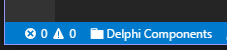

<p align="center">
  <br />
  <a title="Learn more about Project Manager" href="http://github.com/alefragnani/vscode-project-manager"></a>
</p>

# What's new in Project Manager 9

* Moves the Treeview to its own **Activity Bar**
* Adds `Add to Workspace` command to add any project to current workspace
* Use new `NotificationUI` while refreshing projects

# Project Manager

**Project Manager** is an open source extension created for **Visual Studio Code**. While being free and open source, if you find it useful, please consider [supporting it](#support)

It helps you to easily access your projects, no matter where they are located. _Don't miss that important projects anymore_. You can define your own **Favorite** projects, or choose for auto-detect **VSCode** projects, **Git**, **Mercurial** and **SVN** repositories or **any** folder.

Since version 8 you have a dedicated **Activity Bar** for your projects!

Here are some of the features that **Project Manager** provides:

* Save any project as **Favorite**
* Auto-detect **VSCode**, **Git**, **Mercurial** or **SVN** repositiories
* Open projects in the same or new window
* Identify _deleted/renamed_ projects
* A **Status Bar** which identifies the current project
* A dedicated **Activity Bar**

# Features

## Available Commands

* `Project Manager: Save Project` Save the current folder as a new project
* `Project Manager: Edit Project` Edit your projects manually (`projects.json`)
* `Project Manager: List Projects to Open` List all saved/detected projects and pick one
* `Project Manager: List Projects to Open in New Window` List all saved/detected projects and pick one to be opened in New Window
* `Project Manager: Refresh Projects` Refresh the cached projects

## Manage your projects

### Save Project

You can save the current project in the manager at any time. You just need to type a name. It even suggests a name to you _automatically_ :)


 
### Edit Projects

For easier customization of your project list, you can edit the `projects.json` file directly inside **Code**. Just execute `Project Manager: Edit Projects` and the `projects.json` file is opened. Simple as this:

```json
[
    {
        "name": "Pascal MI",
        "rootPath": "c:\\PascalProjects\\pascal-menu-insight",
        "paths": [],
        "group": "",
        "enabled": true
    },
    {
        "name": "Bookmarks",
        "rootPath": "$home\\Documents\\GitHub\\vscode-bookmarks",
        "paths": [],
        "group": "",
        "enabled": true
    },
    {
        "name": "Numbered Bookmarks",
        "rootPath": "$home\\Documents\\GitHub\\vscode-numbered-bookmarks",
        "paths": [],
        "group": "",
        "enabled": false
    }
]
```

For now, only `name`, `rootPath`, and `enabled` fields are used.
> Use a special variable called `$home` while defining any `path`. It will be replaced by the HOME folder.

> Projects that are *not* `enabled` will be hidden from project listings until re-enabled.

> Be sure that the JSON file is well-formed. Otherwise, **Project Manager** will not be able to open it, and an error message like this should appear. In this case, you should use the `Open File` button to fix it.


## Access 

### List Projects to Open

Shows your projects and select one to open.

### List Projects to Open in New Window

Just like **List Projects** but always opening in **New Window**.

## Keyboard Focused Users

If you are a keyboard focused user and uses _Vim like_ keyboard navigation, you can navigate thru the project list with your own keybindings. 

Just use the `when` clause `"inProjectManagerList"`, like:

```json
    {
        "key": "ctrl+j",
        "command": "workbench.action.quickOpenSelectNext",
        "when": "inProjectManagerList"
    }
```

## Available Settings

You can choose how your projects are sorted

* `Saved`: The order that you saved the projects
* `Name`: The name that you typed for the project
* `Path`: The full path of the project
* `Recent`: The recently used projects

```json
    "projectManager.sortList": "Name"
```


* Choose if the project list must be grouped by its _kind_ (**Favorites**, **VS Code**, **Git**, **Mercurial** and **SVN**).

```json
    "projectManager.groupList": true
```

* Should the current project be removed from the list? (`false` by default)

```json
    "projectManager.removeCurrentProjectFromList": true
```

* Should identify _invalid paths_ on project list? (`true` by default)

```json 
    "projectManager.checkInvalidPathsBeforeListing": false
```

* Filter Projects Through Full Path (`false` by default)

```json 
    "projectManager.filterOnFullPath": true
```

* Custom projects file (`projects.json`) location

If you intend to _share_ projects between  **Stable** and **Insider** installations, or if you store your settings in different locations (cloud services), you can indicate an _alternative_ location for the `projects.json` file.

```json
    "projectManager.projectsLocation": "C\\Users\\myUser\\AppData\\Roaming\\Code\\User"
```

* Automatic Detection of Projects (**VSCode** , **Git** , **Mercurial**  and **SVN** )

```json
    "projectManager.git.baseFolders": [
        "c:\\Projects\\code",
        "d:\\MoreProjects\\code-testing",
        "$home\\personal-coding"
    ]
```
> Define the folders which contains the projects

```json
    "projectManager.git.ignoredFolders": [
        "node_modules", 
        "out", 
        "typings", 
        "test"
    ],
```
> Define which folders should be ignored (inside the BaseFolders)

```json
    "projectManager.git.maxDepthRecursion": 4
```
> Define how deeps it should search for projects

* Cache automatically detected projects (`true` by default)

```json 
    "projectManager.cacheProjectsBetweenSessions": false
```

* Display the Project Name in Status Bar (`true` by default)

```json 
    "projectManager.showProjectNameInStatusBar": true
```
 

* Open projects in _New Window_ when clicking in status bar (`false` by default)

```json 
    "projectManager.openInNewWindowWhenClickingInStatusBar": true
```

## Activity Bar

The **Projects** are now presented id its own Activity Bar ,giving you more free space in your Explorer bar. You will have a few extra commands available:
* Open a project, simply clicking in the project item
* Open a project in a New Window, right clicking in the project item
* Add a project to the current Workspace


## Installation and Configuration

You should follow the oficial documentation to:

- [Install the extension](https://code.visualstudio.com/docs/editor/extension-gallery)
- [Modify its settings](https://code.visualstudio.com/docs/getstarted/settings)

## Support

While **Project Manager** is free and open source, if you find it useful, please consider supporting it.

I've been building **Project Manager** since VS Code internal beta days, and while I enjoy developing it, I would like to be able to give more attention to its growth.

<table align="center" width="60%" border="0">
  <tr>
    <td>
      <a title="Paypal" href="https://www.paypal.com/cgi-bin/webscr?cmd=_donations&business=EP57F3B6FXKTU&lc=US&item_name=Alessandro%20Fragnani&item_number=vscode%20extensions&currency_code=USD&bn=PP%2dDonationsBF%3abtn_donate_SM%2egif%3aNonHosted"></a>
    </td>
    <td>
      <a title="Paypal" href="https://www.paypal.com/cgi-bin/webscr?cmd=_donations&business=EP57F3B6FXKTU&lc=BR&item_name=Alessandro%20Fragnani&item_number=vscode%20extensions&currency_code=BRL&bn=PP%2dDonationsBF%3abtn_donate_SM%2egif%3aNonHosted"></a>
    </td>
    <td>
      <a title="Patreon" href="https://www.patreon.com/alefragnani"></a>
    </td>
  </tr>
</table>

---

# License

[MIT](LICENSE.md) &copy; Alessandro Fragnani
