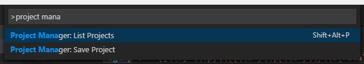

# Functionality

Manage your projects right inside Visual Studio Code. Easily access and switch between them.

# Installation

Press `F1` in VSCode, type `ext install` and then look for `Project Manager`.

# Usage

## Available commands

* **Project Manager: Edit Project** Edit the project list (`projects.json` file) directly inside **Code**
* **Project Manager: List Projects** List all saved projects and pick one
* **Project Manager: Save Project** Save the current project in the manager



### Save Project

You can save the current project in the manager at any time. You just need to type a name. It even suggest you _automatically_ :)


 
### Edit Projects

For easier customization of your project list, you can edit the `projects.json` file directly inside **Code**. Just execute `Project Manager: Edit Projects` and the `projects.json` file is opened. Simple as this:

```json
[
    {
        "label": "Pascal MI",
        "description": "c:\\PascalProjects\\pascal-menu-insight"
    },
    {
        "label": "Bookmarks",
        "description": "$home\\Documents\\GitHub\\vscode-bookmarks"
    },
    {
        "label": "Numbered Bookmarks",
        "description": "$home\\Documents\\GitHub\\vscode-numbered-bookmarks"
    }
]
```
> _new in version 0.8.0_

If you sync your projects between different machines, you can now use a special variable `$home`. It will be replaced by the HOME folder from the current machine when the projects are listed.

> Be sure that the JSON file is well-formed. Otherwise, **Project Manager** will not be able to open it, and an error message like this should appear. In this case, you should use the `Open File` button to fix it.


## Available settings

#### Sort the Project List

Allow you to choose how the projects are sorted in **List Projects** command. You can choose:

* **Saved**: The order that you saved the projects
* **Name**: The name that you typed for the project
* **Path**: The full path of the project

```
    "projectManager.sortList": "Name"
```


#### Open a New Window

Define if you want to open a New Window or just switch the current 
_(default is `true`)_  

```
    "projectManager.openInNewWindow": true
```

# Changelog

## Version 0.8.0

* **New:** Support `$home` variable in project paths (kudos to @efidiles)

## Version 0.7.1

* **Fix:** List Projects command failed when no folder is open (issue [#32](https://github.com/alefragnani/vscode-project-manager/issues/32))

## Version 0.7.0

* **New:** Don't show the current folder/project in the project list (issue [#28](https://github.com/alefragnani/vscode-project-manager/issues/28))
* **New:** Indicate _invalid paths_ in the project list (issue [#30](https://github.com/alefragnani/vscode-project-manager/issues/30))

## Version 0.6.0

* **New:** Use new native API for opening folders _(requires VSCode 1.1.0 or higher)_
* **Fix:** Click or enter in project list does not work (Linux / Mac) (issue [#27](https://github.com/alefragnani/vscode-project-manager/issues/27))
* **Removed Settings:** The `projectManager.codePath` and `projectManager.useAlternativeMacOSXPath` where removed because are not necessary anymore.

## Version 0.5.5

* **Fix:** Saving projects not working in Linux (issue [#16](https://github.com/alefragnani/vscode-project-manager/issues/16)
* Readme updated to better explain how to install and configure the extension

## Version 0.5.4

* **Fix:** Updated instructions for Mac OS X after Code February Release (issue [#14](https://github.com/alefragnani/vscode-project-manager/issues/14) - Thanks to @satokaz, @janmarek and @csholmq)

## Version 0.5.3

* **Fix:** Save Project was using the whole path (issue [#12](https://github.com/alefragnani/vscode-project-manager/issues/12))

## Version 0.5.2

* **Fix:** Project switch not working for network folders (UNC Notation) (issue [#10](https://github.com/alefragnani/vscode-project-manager/issues/10))

## Version 0.5.1

* **Fix:** Interim fix for project switching not working in Mac OS X (issue [#7](https://github.com/alefragnani/vscode-project-manager/issues/7) - Thanks to @satokaz)

## Version 0.5.0

* **New:** The `projects.json` file is now formatted (Thanks to @cuth [PR #6](https://github.com/alefragnani/vscode-project-manager/pull/6))
* **Fix:** The `List Projects` keybinding was not working property (issue [#8](https://github.com/alefragnani/vscode-project-manager/issues/8)) 

## Version 0.4.0

* **New Command:** Edit Projects

## Version 0.3.1

* **Fix:** Project switch not working properly (issue [#5](https://github.com/alefragnani/vscode-project-manager/issues/5))

## Version 0.3.0

* **New Setting:** Indicate Code path
* **New Setting:** Open a New Window when you choose a project, or just switch the current
* **Fix:** Spaces in Project Path (issue [#3](https://github.com/alefragnani/vscode-project-manager/issues/3))

## Version 0.2.0

* License updated

## Version 0.1.1

* Initial release

## Participate

If you have any idea, feel free to create issues and pull requests

# License

[MIT](LICENSE.md) &copy; Alessandro Fragnani

---

[](https://www.paypal.com/cgi-bin/webscr?cmd=_donations&business=EP57F3B6FXKTU&lc=US&item_name=Alessandro%20Fragnani&item_number=vscode%20extensions&currency_code=USD&bn=PP%2dDonationsBF%3abtn_donate_SM%2egif%3aNonHosted) if you enjoy using this extension :-)
