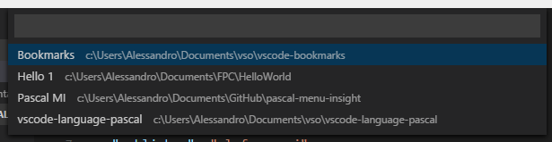
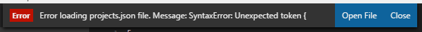
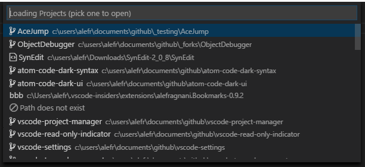
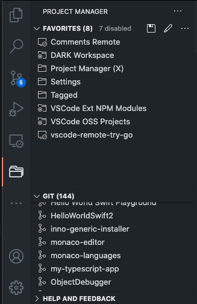
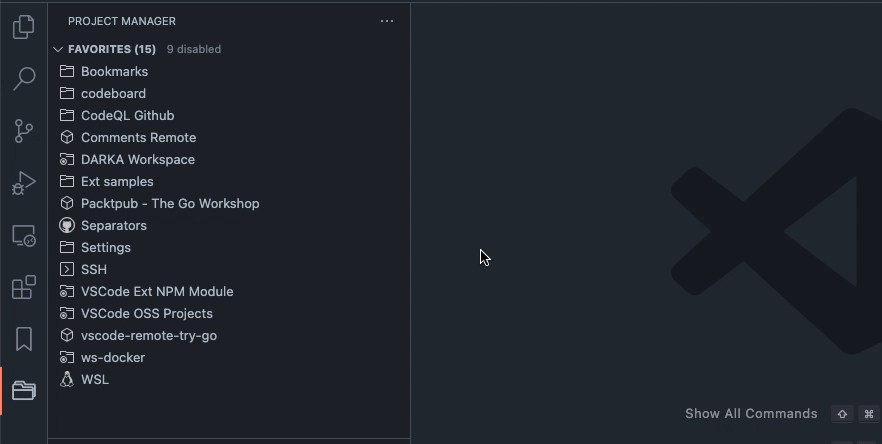

[](https://marketplace.visualstudio.com/items?itemName=alefragnani.project-manager)
[](https://marketplace.visualstudio.com/items?itemName=alefragnani.project-manager)
[](https://marketplace.visualstudio.com/items?itemName=alefragnani.project-manager)

<p align="center">
  <br />
  <a title="了解更多 Project Manager 信息" href="https://github.com/alefragnani/vscode-project-manager"></a>
</p>

[English](README.md) | 简体中文

# Project Manager 13.1 更新内容

* 改进了 **Tags** 支持
* 改进了**自动检测项目**支持
* 再次完全开源
* 增加 **Profile** 支持
* 在 Side Bar 中高亮当前项目
* 发布到 **Open VSX**
* 增加 **Getting Started / Walkthrough**
* 使用 **Tags** 组织项目
* 增加 **Virtual Workspaces** 支持
* 增加 **Workspace Trust** 支持

# 支持项目

**Project Manager** 是为 **Visual Studio Code** 打造的扩展。如果你觉得它有帮助，欢迎支持本项目。

<table align="center" width="60%" border="0">
  <tr>
    <td>
      <a title="Paypal" href="https://www.paypal.com/cgi-bin/webscr?cmd=_donations&business=EP57F3B6FXKTU&lc=US&item_name=Alessandro%20Fragnani&item_number=vscode%20extensions&currency_code=USD&bn=PP%2dDonationsBF%3abtn_donate_SM%2egif%3aNonHosted"></a>
    </td>
    <td>
      <a title="GitHub Sponsors" href="https://github.com/sponsors/alefragnani"></a>
    </td>
    <td>
      <a title="Patreon" href="https://www.patreon.com/alefragnani"></a>
    </td>
  </tr>
</table>

# Project Manager

它可以帮助你轻松访问自己的**项目**，无论这些项目位于哪里。_不要再错过那些重要项目_。

你既可以定义自己的**项目**（也叫 **Favorites**），也可以自动检测 **Git**、**Mercurial**、**SVN** 仓库、**VSCode** 文件夹，或者**任意**其他文件夹。

以下是 **Project Manager** 提供的部分功能：

* 将任意文件夹或工作区保存为**项目**
* 自动检测 **Git**、**Mercurial** 或 **SVN** 仓库
* 使用 **Tags** 组织项目
* 在当前窗口或新窗口打开项目
* 识别已_删除/重命名_的项目
* 通过 **Status Bar** 标识当前项目
* 提供专用 **Side Bar**

# 功能

## 可用命令

* `Project Manager: Save Project` 将当前文件夹/工作区保存为新项目
* `Project Manager: Edit Project` 手动编辑你的项目（`projects.json`）
* `Project Manager: List Projects to Open` 列出所有已保存/已检测项目并选择一个打开
* `Project Manager: List Projects to Open in New Window` 列出所有已保存/已检测项目并在新窗口打开
* `Project Manager: Filter Projects by Tag` 按选定标签筛选 Favorite 项目

## 管理项目

### Save Project

你可以随时将当前文件夹/工作区保存为一个**项目**，只需输入项目名称。



> 扩展会_自动_为你建议一个名称 :)
 
### Edit Projects

为了更方便地自定义项目列表，你可以直接在 **Code** 中编辑 `projects.json` 文件。只需执行 `Project Manager: Edit Projects`，扩展就会打开 `projects.json` 文件。就这么简单：

```json
[
    {
        "name": "Pascal MI",
        "rootPath": "c:\\PascalProjects\\pascal-menu-insight",
        "tags": [],
        "enabled": true,
        "profile": "Delphi"
    },
    {
        "name": "Bookmarks",
        "rootPath": "$home\\Documents\\GitHub\\vscode-bookmarks",
        "tags": [
            "Personal",
            "VS Code"
        ],
        "enabled": true,
        "profile": "VSCode"
    },
    {
        "name": "Numbered Bookmarks",
        "rootPath": "~\\Documents\\GitHub\\vscode-numbered-bookmarks",
        "tags": [
            "Personal",
            "VS Code"
        ],
        "enabled": false,
        "profile": "VSCode"
    }
]
```

> 你可以在路径中使用 `~` 或 `$home`，它们会被替换为你的 HOME 文件夹。

> 请确保 JSON 文件格式正确。否则，**Project Manager** 将无法打开它，并会显示如下错误提示。在这种情况下，请使用 `Open File` 按钮进行修复。



## 访问

### List Projects to Open

显示你的项目并选择一个打开。

### List Projects to Open in New Window

与 **List Projects** 类似，但始终在**新窗口**打开。

## 键盘优先用户

如果你是键盘优先用户，并使用类似 _Vim_ 的键盘导航方式，你可以通过自定义键绑定在项目列表中导航。

只需使用 `when` 条件 `"inProjectManagerList"`，例如：

```json
  {
    "key": "cmd+j",
    "command": "workbench.action.quickOpenSelectNext",
    "when": "inProjectManagerList && isMac"
  },
  {
    "key": "cmd+shift+j",
    "command": "workbench.action.quickOpenSelectPrevious",
    "when": "inProjectManagerList && isMac"
  },
  {
    "key": "ctrl+j",
    "command": "workbench.action.quickOpenSelectNext",
    "when": "inProjectManagerList && (isWindows || isLinux)"
  },
  {
    "key": "ctrl+shift+j",
    "command": "workbench.action.quickOpenSelectPrevious",
    "when": "inProjectManagerList && (isWindows || isLinux)"
  }
```

## 远程开发场景

该扩展支持 [Remote Development](https://code.visualstudio.com/docs/remote/remote-overview) 场景，你可以根据自己的需要使用。

### 我会访问远程环境，但大部分工作仍在本地

这是最_常见_的场景，所以你不需要做任何额外配置，扩展开箱即用。

当扩展安装在本地时，你可以将 Container、SSH、WSL 或 Codespaces 项目保存为 Favorites。每种类型都有对应图标可用于区分，选择后 VS Code 会自动打开对应远程。

_It just works_

### 如果我大部分工作都在远程环境中

如果你通常连接远程环境（如 SSH/WSL），并希望在远程端保存 Favorites，或自动检测远程上的仓库，你必须让扩展在远程端激活/安装。

你只需要在 `User Settings` 中添加如下配置：

```json
  "remote.extensionKind": {
    "alefragnani.project-manager": [
      "workspace"
    ]
  },
```

> 更多细节请参考 [VS Code documentation](https://code.visualstudio.com/docs/remote/containers#_advanced-forcing-an-extension-to-run-locally-or-remotely)

## 可用设置

你可以选择项目列表的排序方式：

* `Saved`: 按保存顺序
* `Name`: 按项目名称
* `Path`: 按项目完整路径
* `Recent`: 按最近使用

```json
  "projectManager.sortList": "Name"
```



* 选择项目列表是否按类型分组（**Favorites**、**Git**、**Mercurial**、**SVN** 和 **VS Code**）。

```json
  "projectManager.groupList": true
```

* 是否将当前项目从列表中移除（默认 `false`）

```json
  "projectManager.removeCurrentProjectFromList": true
```

* 是否在列出项目时识别_无效路径_（默认 `true`）

```json 
  "projectManager.checkInvalidPathsBeforeListing": false
```

* 是否在 `baseFolders` 上支持符号链接（默认 `false`）

```json 
  "projectManager.supportSymlinksOnBaseFolders": true
```

* 当检测到同名项目时，是否显示父目录信息（默认 `false`）

```json 
  "projectManager.showParentFolderInfoOnDuplicates": true
```

* 通过完整路径筛选项目（默认 `false`）

```json 
  "projectManager.filterOnFullPath": true
```

* 自定义项目文件（`projects.json`）位置

如果你希望在 **Stable** 和 **Insider** 安装之间_共享_项目，或者将设置存储在不同位置（如云服务），可以为 `projects.json` 指定一个_备用_目录。

```json
  "projectManager.projectsLocation": "C:\\Users\\myUser\\AppData\\Roaming\\Code\\User"
```

> 你可以在目录路径中使用 `~` 或 `$home`，它们会被替换为你的 HOME 文件夹。

* 自动检测项目（**Git** , **Mercurial** , **SVN**  和 **VSCode** ）

```json
  "projectManager.git.baseFolders": [
    "c:\\Projects\\code",
    "d:\\MoreProjects\\code-*",
    "$home\\personal-coding"
  ]
```
> 指定用于搜索项目的文件夹或 [glob patterns](https://code.visualstudio.com/docs/editor/glob-patterns)

```json
  "projectManager.git.ignoredFolders": [
    "node_modules", 
    "out", 
    "typings", 
    "test",
    "fork*"
  ],
```
> 指定搜索项目时需要忽略的文件夹或 [glob patterns](https://code.visualstudio.com/docs/editor/glob-patterns)

```json
  "projectManager.git.maxDepthRecursion": 4
```
> 定义搜索项目的深度

* 从自动检测结果中排除 base folders 本身（默认 `false`）

```json
  "projectManager.any.excludeBaseFoldersFromResults": true
```
> 启用后，配置在 `projectManager.any.baseFolders` 中的 **Any** base folders 不会作为项目本身返回，只会返回其匹配的子文件夹。

* 是否忽略位于其他项目内部的项目（默认 `false`）

```json 
  "projectManager.ignoreProjectsWithinProjects": true
```

* 缓存自动检测的项目（默认 `true`）

```json 
  "projectManager.cacheProjectsBetweenSessions": false
```

* 在状态栏显示项目名称（默认 `true`）

```json 
  "projectManager.showProjectNameInStatusBar": true
```

* 点击状态栏时在_新窗口_打开项目（默认 `false`）

```json 
  "projectManager.openInNewWindowWhenClickingInStatusBar": true
```

* 指示 `New Window` 命令在窗口为空时是否改为在当前窗口打开（默认 `always`）

  * `always`: 每次调用 Open in New Window 命令时，如果窗口为空则在当前窗口打开
  * `onlyUsingCommandPalette`: 仅通过命令面板调用时在当前窗口打开
  * `onlyUsingSideBar`: 仅通过侧边栏调用时在当前窗口打开
  * `never`: 与当前行为一致，Open in New Window 命令始终在新窗口打开

```json 
  "projectManager.openInCurrentWindowIfEmpty": "always"
```

* 指示用于组织项目的标签列表（默认 `Personal` 和 `Work`）

```json
  "projectManager.tags": [
    "Personal", 
    "Work",
    "VS Code",
    "Learning"
  ]
```

* 控制 Favorites 视图里标签分组如何展开/折叠，以及是否记住状态（默认 `startExpanded`）

  * `alwaysExpanded`: 标签分组始终展开
  * `alwaysCollapsed`: 标签分组始终折叠
  * `startExpanded`: 标签分组初始展开，并记住上一次展开/折叠状态
  * `startCollapsed`: 标签分组初始折叠，并记住上一次展开/折叠状态

```json
  "projectManager.tags.collapseItems": "startExpanded"
```

## 可用颜色

* 选择用于在 Side Bar 高亮当前项目的前景色
```json
  "workbench.colorCustomizations": {
    "projectManager.sideBar.currentProjectHighlightForeground": "#e13015"  
  }
```

## Side Bar

**Project Manager** 扩展有自己的 **Side Bar**，提供了多种命令来提升你的效率。



### Project Tags - View and Filter

从 v12.3 开始，你可以使用 **Tags** 来组织项目。

你可以定义自定义标签（通过 `projectManager.tags` 设置）、为每个项目定义多个**标签**，并根据**标签**筛选项目。



## 安装与配置

你可以参考官方文档来：

- [Install the extension](https://code.visualstudio.com/docs/editor/extension-gallery)
- [Modify its settings](https://code.visualstudio.com/docs/getstarted/settings)

# 许可证

[GPL-3.0](LICENSE.md) &copy; Alessandro Fragnani