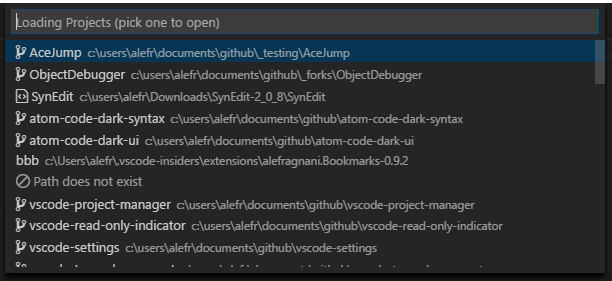

## Find and Open Projects

You can quickly access all your projects in the **Command Palette** using the `Project Manager: List Projects to Open` command, or the exclusive **Side Bar**.

To access the projects via **Command Palette**, you can also use the built in keyboard shortcut <kbd>Shift</kbd> + <kbd>Alt</kbd> + <kbd>P</kbd> / <kbd>Cmd</kbd> + <kbd>Alt</kbd> + <kbd>P</kbd> (on MacOS).

The projects can be filtered by its name or path.

### Command Palette

