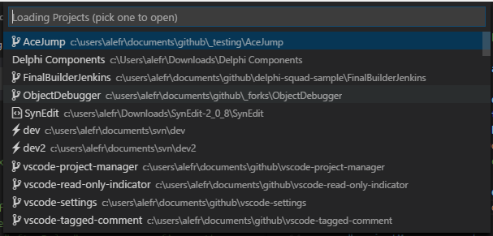

## Layihələrinizi tapın və açın

Bütün layihələrinizə **Əmr paletində** `Project Manager: Açmaq üçün layihələri sırala` əmri ilə və ya özəl **Yan panel** vasitəsilə sürətlə daxil ola bilərsiniz.

Layihələrə **Əmr paleti** ilə daxil olmaq üçün daxili qısayoldan da istifadə edə bilərsiniz: <kbd>Shift</kbd> + <kbd>Alt</kbd> + <kbd>P</kbd> / <kbd>Cmd</kbd> + <kbd>Alt</kbd> + <kbd>P</kbd> (MacOS-da).

Layihələri adına və ya yoluna görə süzgəcdən keçirmək olar.

### Əmr paleti

