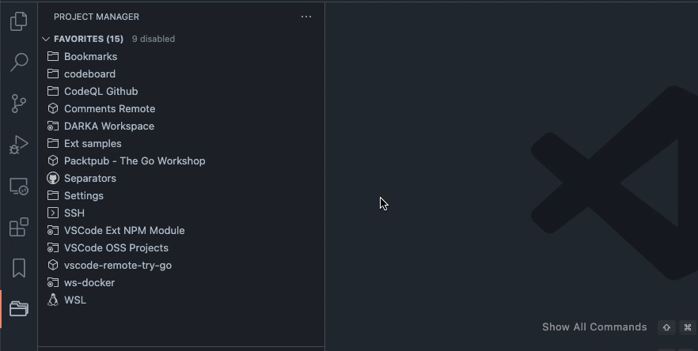

## Organize com Etiquetas

Você pode organizar/categorizar seus projetos usando **Etiquetas**. Filtre seus projetos por **Etiquetas** e até mesmo escolha **Etiquetas** ativas que são mais relevantes para o trabalho que você está fazendo.

