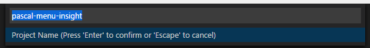

## Seçilmiş layihələrinizi saxlayın

Cari qovluğu və ya iş sahəsini istənilən vaxt **Layihə** kimi yadda saxlaya bilərsiniz. Sadəcə onun adını yazmaq kifayətdir. 

Qısayol olaraq, açdığınız qovluğun / iş sahəsinin adını layihənin adı kimi _avtomatik_ təklif edir.

Yadda saxladıqdan sonra layihə **Əmr paletində** və özəl **Yan paneldə** əlçatan olacaq.
