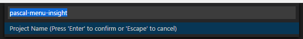

## Salve Seus Projetos Favoritos

Você pode salvar a pasta ou workspace corrente como um **Projeto** a qualquer momento. Você só precisa digitar o nome desejado.. 

A extensão irá sugerir o nome do projeto _automaticamente_, baseado no nome da pasta / workspace que você tem aberto.

Uma vez salvo, ele estará disponível na **Paleta de Comandos** e na **Barra Lateral** exclusiva.